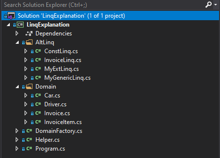

# Wstęp
Wchodząc w świat języka C# i frameworka .Net świeży programista dość szybko styka się z technologią Linq. Nawet jeśli zapozna się wcześniej z dokumentacją i dokładnie przejdzie przez większość konceptów i mechanizmów programowania w tej technologii, to stosując Linq, nie zawsze do końca rozumie jak ono jest zbudowane i jak działa. Zazwyczaj wcale nie przeszkadza to w sprawnym operowaniu na kolekcjach. Mówiąc prościej i bardziej obrazowo.

```csharp
/* Świeżak , masz tu listę faktur */
List<Invoice> invoices;
invoices = GetAllInvoices();
/* Zwróć mi proszę z tej listy tylko te faktury, których wartość jest większa niż 2000 */
```

 ```csharp 
var filteredInvoices = invoices.Where(x=>x.InvoiceValue >2000);
/* Proszęęęęę */
```
  Proste. Większość początkujących developerów da sobie radę z tak postawionym problemem. Spora część z nich, wykona to jednak bezrefleksyjnie, nie dokońca rozumiejąc w pełni zastosowaną składnię.  Jak to się dzieje, że używamy jakiejś metody ‘Where’ na naszej liście faktur? Przecież nigdzie nie deklarowaliśmy jej na żadnej klasie. Co to za dziwna konstrukcja z tymi ‘x’ i jakimiś dziwnymi strzałkami ? Wiem, że tak to się robi, ale dlaczego, co tu się właściwie wydarzyło ?
  
  Przez to że LINQ jest tak powszechne i każdy programista .NET styka się z nim już na samym początku swojej drogi, jest to dobry element do wyjaśnienia pewnych konceptów, które podczas poznawania C# mogły zostać potraktowane trochę po macoszemu. Będą więc tutaj rozkminiane:
 -	Delegaty
 -	Delegaty generyczne
 -	Wyrażenia lambda
 - Metody rozszerzające

 Przy okazji możemy też wspomnień coś więcej ogólnie o klasach generycznych na przykładzie generycznych kolekcji i nieco rozjaśnić idee magicznego interfejsu IEnumerable.

  Zapomnijmy na moment, że mamy do dyspozycji LINQ. Spróbujmy napisać nasze własne uproszczone implementacje tej biblioteki, przechodząc krok po kroku przez różne bariery. Tłumaczenie może być mocno łopatologiczne  ale taki nietypowy sposób wybrałem na wyjaśnienie tematu.
  
  ### Projekt
  Podczas omawiania problemu, przykładowy projekt i klasy wchodzące w jego skład warto budować stopniowo, krok po kroku wszystko wyjaśniając.
  Finalny Projekt będzie wyglądał tak:
  
  
  
  Co zawierają poszczególne foldery i klasy?
  
  - Folder Domain - zawiera przykładowe klasy naszych kolekcji
  - Klasa DomainFactory - to kreator przykładowych kolekcji tych klas
  - Klasa Helper - to klasa, w której umieściliśmy kilka pomocniczych metod. Głównie do wyswietlania wyników w konsoli, ale też przykładowe metody zwracające wartość bool dla parametru Invoice
  - Klasa Program - tutaj odbywają się wszelkie testy budowanych mechanizmów
  - Folder AltLinq - tutaj stopniowo budujemy alternatywne wersje dla naszego LINQ
  
  ### Main
  W metodzie Main naszego programu tworzymy przykładowe kolekcje
  ```csharp 
  var invoices = DomainFactory.FakeInvoiceList();
  var drivers = DomainFactory.FakeDriverList();
  ```
  ### Krok 0
  Na rozgrzewkę wykonajmy na nich kilka filtrowań za pomocą metody Where z oryginalnego LINQ
  ```csharp 
  var linqWarsawInvoices = invoices.Where(x=>x.City=="Warszawa");
  var linqAprilInvoices = invoices.Where(x => x.CrtDate.Month==4);
  var linqInvoicesWithValueMoreThan30 = invoices.Where(x => x.Value>30);
  var linqAuchanInvoices = invoices.Where(x => x.Customer=="Auchan");
  var linqInvoicesWithBeer = invoices.Where(x => x.InvoiceItems.Any(y => y.ItemName == "Beer"));
  ```
  Nie będziemy wyświetlać wyników w konsoli, ale zapewniam, że wynikowe kolekcje zawierają wyniki zgodne z intencją.
  ### Krok 1
  Cofnijmy się nieco w czasie do roku 2007. Nie został jeszcze wydany VS 2008 z C# 3.0 i .Net Framework 3.5. Nie  dysponujemy jeszcze technologią LINQ.  Spróbujmy zwrócić listę faktur na Warszawę.
  Bez zbędnych wyjaśnień, najprościej zrobimy to tak:
  ```csharp 
  var warsawInvoices = new List<Invoice>();
   foreach (var invoice in invoices)
   {
       if (invoice.City == "Warszawa")
       {
           warsawInvoices.Add(invoice);
       }
   }
   ```
  I jeszcze trochę bardziej złożony przykład. Zwróćmy te faktury, które w swoich pozycjach zawierają piwo.
  ```csharp 
  var invoicesWithBeer = new List<Invoice>();
  foreach (var invoice in invoices)
  {
      foreach (var invoiceItem in invoice.InvoiceItems)
      {
          if (invoiceItem.ItemName == "Beer")
          {
              invoicesWithBeer.Add(invoice);
              break;
          }
      }
  }
  ```
  Na wszelki wypadek szybkie wyjaśnienie co tu się zadziało. Iterujemy po każdej fakturze w kolekcji. Dla każdej faktury iterujemy po każdej pozycji. Sprawdzamy czy nazwa pozycji to piwo. Jeśli tak to przerywamy tą niższą iterację i przechodzimy do sprawdzania kolejnej faktury. Oczywiście Piwo na pozycji powoduje dodanie faktury do nowej wynikowej kolekcji.
  ### Krok 2
  Stwórzmy statyczną klasę ConstLinq z dwiema metodami, które zrobią dokładnie to co nasze iteracje wyżej. Czyli tak naprawdę opakujmy ten kod w osobne metody.
  ```csharp
  public static class ConstLinq
    {
        public static IEnumerable<Invoice> WhereInvoiceCityIsEqualWarsaw(IEnumerable<Invoice> invoices)
        {
            var resultList = new List<Invoice>();
            foreach (var invoice in invoices)
            {
                if (invoice.City == "Warszawa")
                {
                    resultList.Add(invoice);
                }
            }
            return resultList;
        }

        public static IEnumerable<Invoice> WhereInvoiceHasBeer(IEnumerable<Invoice> invoices)
        {
            var resultList = new List<Invoice>();
            foreach (var invoice in invoices)
            {
                foreach (var invoiceItem in invoice.InvoiceItems)
                {
                    if (invoiceItem.ItemName == "Beer")
                    {
                        resultList.Add(invoice);
                        break;
                    }
                }
            }
            return resultList;
        }
    }
  ```
  
    
    Wywołanie tych metod na naszej pierwszej pseudo klasie LINQ będzie wyglądało tak:
    Metody przyjmują w parametrze pełne kolekcje a zwracają już pofiltrowane
```csharp

    var clInvoicesWithBeer = ConstLinq.WhereInvoiceHasBeer(invoices);
    var clWarsawInvoices = ConstLinq.WhereInvoiceCityIsEqualWarsaw(invoices);
```
### Krok 3
Czas na delegaty. Utwórzmy kolejną klasę statyczną InvoiceLinq, w której zamiast osobnych metod na każdą ewentualność, czyli filtracje faktur po mieście, po produkcie, po dacie, po sklepie itp, , będziemy mieli jedną uniwersalną metodę. Dalej będzie ona operowała tylko na kolekcji faktur i żadnej innej, ale warunek sprawdzania pojedynczej faktury stanie się bardziej uniwersalny.
```csharp
public static class InvoiceLinq
    {
        public delegate bool CheckIfConditionIsTrue(Invoice invoice);
        //Func<Invoice,bool>
        
        public static IEnumerable<Invoice> Where(IEnumerable<Invoice> invoices, CheckIfConditionIsTrue checkIfConditionIsTrue)
        {
            var resultList = new List<Invoice>();
            foreach (var invoice in invoices)
            {
                if(checkIfConditionIsTrue(invoice))
                {
                    resultList.Add(invoice);
                }
            }
            return resultList;
        }

        public static IEnumerable<Invoice> WhereByFunc(IEnumerable<Invoice> invoices, Func<Invoice,bool> invoiceDelegate)
        {
            var resultList = new List<Invoice>();
            foreach (var invoice in invoices)
            {
                if (invoiceDelegate(invoice))
                {
                    resultList.Add(invoice);
                }
            }
            return resultList;
        }
    }
```
W górnej części naszej klasy pojawia się nowy byt. Deklaracja delegaty. To w pewnym sensie deklaracja jakiejś dowolnej metody, która jako parametr przyjmie klasę Invoice i zwróci wynik typu bool. Nie interesuje nas ciało i logika tych metod. Jedyną zasadą jakie muszą spełniać to ten parametr i rezultat.

Metoda Where w tej klasie zwróci nam kolekcję faktur, ale jako parametry musi przyjąć (pełną)kolekcję faktur i jakąś dowolna metodę, która spełnia kryteria określone w naszej delegacie.  W ciele tej metody widać, że na każdej fakturze w kolekcji faktur będzie wykonywana ta metoda i jeśli zwróci True, to taką fakturę dodajemy do naszej kolekcji wynikowej.

Tak na prawdę klasyczne delegaty jakiej tu użyliśmy straciły już dawno sens. Po co nazywać i deklarować za każdym razem taką delegatę, skoro wydaje się , że jest ich skończona ilość. Odpowiedniki wszelkich metod void możemy zastąpić przez generyczną delegatę Action, która może przyjąć parametry od 0 do 17, różnego typu. Podobnie jest z metodami, które zwracają jakiś wynik. Generyczna Delegata Func, może przyjmować równie dużą ilość parametrów, zwracając jeden. W naszym przykładzie możemy zastąpić klasyczną delegatę public delegate bool CheckIfConditionIsTrue(Invoice invoice) przez delegatę generyczną Func<Invoice,bool> i tym samym pominąć element jej deklaracji. metoda WhereByFunc robi dokładnie to co metoda Where, ale bazuje właśnie na delegacie generycznej.

Zostańmy ostatni raz przy starym podejściu i klasycznych delegatach. W naszej aplikacji Program, mamy kod deklarujący delegatę, przypisujący do niej jakąś metodę z naszego Helpera, spełniającą warunki sygnatury tej delegaty, a następnie wywołanie metody Where, gdzie jednym z parametrów jest właśnie przekazana metoda naszego helpera w miejsce delegaty.
```csharp
InvoiceLinq.CheckIfConditionIsTrue del1 = Helper.IsCityEqualWarszawa;
var result1 = InvoiceLinq.Where(invoices, del1);

InvoiceLinq.CheckIfConditionIsTrue del2 = Helper.IsIdLessThanTree;
var result2 = InvoiceLinq.Where(invoices, del2);
```
Mam nadzieję , że idea delegat została już co nieco wyjaśniona. To w pewnym sensie wzorzec dla metody. Deklarując delegatę, mówimy, że pasuje do niej każda metoda, która daje wynik tego samego typu i przyjmuje parametry tego samego typu co nasz wzorzec.
### Krok 4
Czas na wyrażenia Lambda.
Weźmy na tapetę jedną z metod spełniającą regóły naszej delegaty, i postarajmy się nieco ją uprościć
```csharp
public static bool IsCityEqualWarszawa(Invoice invoice)
 {
     if (invoice.City == "Warszawa")
     {
         return true;
     }
     return false;
 }
```
Po kolei:
- zmieńmy ciało tej metody na ternary operator, a nastepnie upraszczając jeszcze bardziej, zostawmy to po prostu wyrażeniem logicznym
```csharp
return (invoice.City=="Warszawa") ? true: false
```
```csharp
return invoice.City=="Warszawa"
```
- zastapmy klamry strzałką =>
- usuńmy kwantyfikator dostepu public i słowo static
- usuńmy słowo return
- usuńmy typ i nazwę metody
- usuńmy typ parametru Invoice
- skóćmy nazwę zmiennej invoice np. do x
- usuńmy nawiasy okalające parametr naszej metody
W efekcie otrzymamy:
```csharp
x=>x.City=="Warszawa"
```
Co prawda nie da się zapisać takiego kodu gdzieś luzem, ale możemy już go wstawić do naszej metody Where w klasie InvoiceLinq w miejsce parametru delegaty.
```csharp
var result3 = InvoiceLinq.Where(invoices, x => x.City == "Warszawa");
```
Spróbujmy jednak taki zapis lambda przypisać do zmiennej i użyć w metodzie tą zmienną:
```csharp
InvoiceLinq.CheckIfConditionIsTrue del5a = x => x.City == "Warszawa";
var result5a = InvoiceLinq.Where(invoices, del5a);
```           
Acha ...Mieliśmy już nie używać klasycznych delegat, więc spróbujmy to samo z delegatą generyczną Func
```csharp
var result4 = InvoiceLinq.WhereByFunc(invoices, x => x.City == "Warszawa");
```
i jeszcze jako zmienna:
```csharp
Func<Invoice,bool> del5b = x => x.City == "Warszawa";
var result5b = InvoiceLinq.WhereByFunc(invoices, del5b);
```   
### Krok 5
Nasz klasa InvoiceLinq i jej metoda ( właściwie 2 podobne metody Where i WhereByFunc ) choć zyskały w pewnym sensie pewien uniwersalizm i mogą przyjmować w parametrze  dowolną metodę operująca na klasie Invoice i zwracającą wartość bool, to są ograniczone tylko do klasy Invoice.
Dysponując kolekcjami innego typu, nic nam po tej klasie. Tutaj do gry wchodzą kolekcje i klasy generyczne. Pamiętamy, że utworzyliśmy sobie na początku zupełnie niezwiązaną z fakturami kolekcję kierowców. Możemy mieć też kolekcje jeszcze innych typów. Czy można przebudować naszą klasę InvoiceLinq, żeby mogła operować na kolekcjach dowolnego typu ? Tak.
Taka klasa wyglądać by mogła tak jak niżej. Dodajmy ją do naszego projektu do folderu AltLinqu.
```csharp
public static class MyGenericLinq
    {

        public delegate bool GenericCheckIfConditionIsTrue<T>(T element);
        //public Func<T,bool>

        public static IEnumerable<T> GenericWhere<T>(IEnumerable<T> elements, GenericCheckIfConditionIsTrue<T> func)
        {
            var resultList = new List<T>();
            foreach (var element in elements)
            {
                if (func(element))
                {
                    resultList.Add(element);
                }
            }
            return resultList;
        }

        public static IEnumerable<T> GenericWhereByFunc<T>(IEnumerable<T> elements, Func<T,bool> func)
        {
            var resultList = new List<T>();
            foreach (var element in elements)
            {
                if (func(element))
                {
                    resultList.Add(element);
                }
            }
            return resultList;
        }
    }
```
Jak widać nie zwracają oni już kolekcji określonego typu Invoice a kolekcję typu generycznego, czyli bliżej nieokreślonego typu, który określiliśmy sobie zgodnie z konwencją literą T, ale równie dobrze mogłoby to być każde inne słowo.

Podobnie przyjmowany parametr to już nie kolekcja faktur a kolekcja naszego typu generycznego T. Dlatego nadaliśmy jej już bardziej ogólną nazwę niż invoices. Elements wydaje się bardziej pasować do dowolnego bytu. W ciele naszych metod operujemy na elementach typu T, ale  jak widać konstrukcja jest bardzo podobna jak w metodach klasy InvoiceLinq.
Przetestujmy naszą nową klasę i jej metody w naszej klasie Program, przy okazji jeszcze inaczej deklarując nasz delegat
```csharp
bool del6(Invoice x) => x.City == "Warszawa";
var result6 = MyGenericLinq.GenericWhere<Invoice>(invoices, del6);
```
i wreszcie czas na finał tego punktu. Sprawdźmy czy nasza nowa klasa i jej metody, równie dobrze radzi sobie na kolekcjach innego typu.
Już w formie jednej linii wyfiltrujmy kierowców z kolekcji drivers, którzy mają więcej niż 33 lata:
```csharp
var result7 = MyGenericLinq.GenericWhere<Driver>(drivers, x => x.Age > 33);
```
Wszystko działa świetnie. Dodam tylko, że w obu powyższych fragmentach kodu możemy nawet usunąć <Invoice> i <Drivers>. Kompilator poradzi sobie bez takiej jawnej deklaracji typu w naszej metodzie. Wie, że skoro przekazujemy do metody kolekcję typu Invoice to typem generycznym jest Invoice, a jeśli przekazujemy kolekcję typu Driver to typem jest Driver.
```csharp
var result6 = MyGenericLinq.GenericWhere(invoices, del6); 
var result7 = MyGenericLinq.GenericWhere(drivers, x => x.Age > 33);
```
### Krok 6
Czas na ostatni koncept języka C# stosowany w mechanizmie LINQ.  W klasach, które budowaliśmy do tej pory, nie operowaliśmy bezpośrednio na naszych kolekcjach a przekazywaliśmy je do osobnej klasy i metody jako parametr. Oryginalne LINQ tak nie wygląda. W jakiś magiczny sposób nasze kolekcje posiadają już metodę Where i inne metody LINQ.
To w sumie nie żadna magia a metody rozszerzeń, czyli Extension Methods. Mechanizm na pewno pojawiający się we wszelkich kursach języka C#, ale w praktyce wcale nie używany na co dzień, więc może umknąć rzucanym na głęboką wodę juniorom.
Utwórzmy ostatnią klasę myExtLinq, która będzie już zawierała tylko jedną metodę opartą na delegacie generycznym Func. Przed parametrem reprezentującym naszą wejściową generyczną kolekcję dodajmy słowo this. To sprawi, że będziemy bez odwoływania się do naszej klasy mogli operować tą metodą bezpośrednio na naszej kolekcji.
 ```csharp
 public static class MyExtLinq
 {
     public static IEnumerable<T> MyOwnWhere<T>(this IEnumerable<T> elements, Func<T,bool> func)
     {
         var resultList = new List<T>();
         foreach (var element in elements)
         {
             if (func(element))
             {
                 resultList.Add(element);
             }
         }
         return resultList;
     }
 }
 ```
 Na zakończenie jeszcze użycie metody z tej klasy bezpośrednio na naszych kolekcjach
 ```csharp
var result8 = drivers.MyOwnWhere(x => x.Age > 33);
var result9 = invoices.MyOwnWhere(x => x.Value > 30);
```


       


    


    
    
  
  
